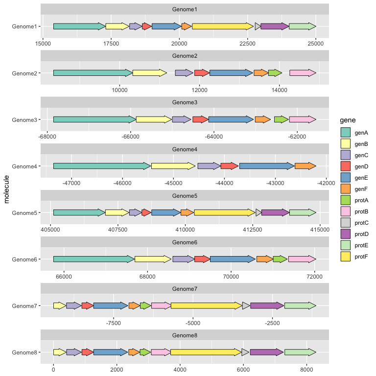
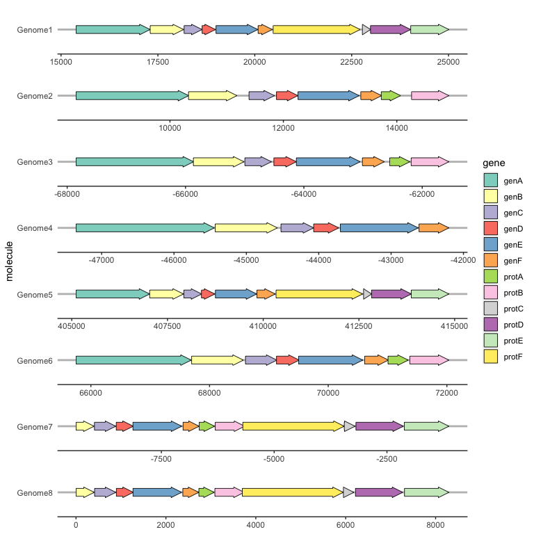
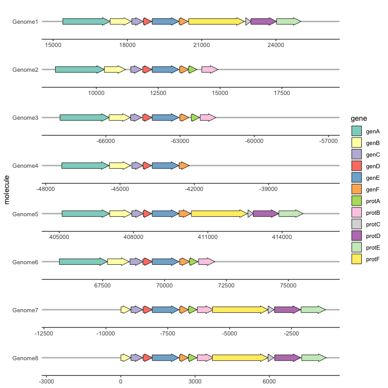
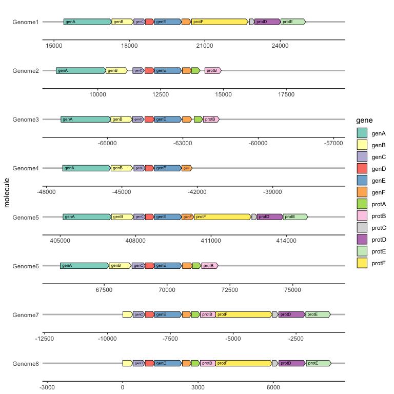
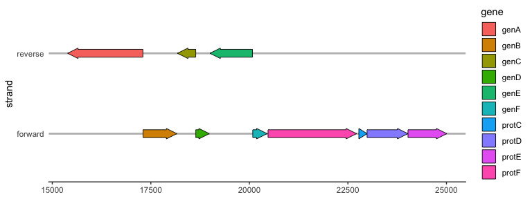
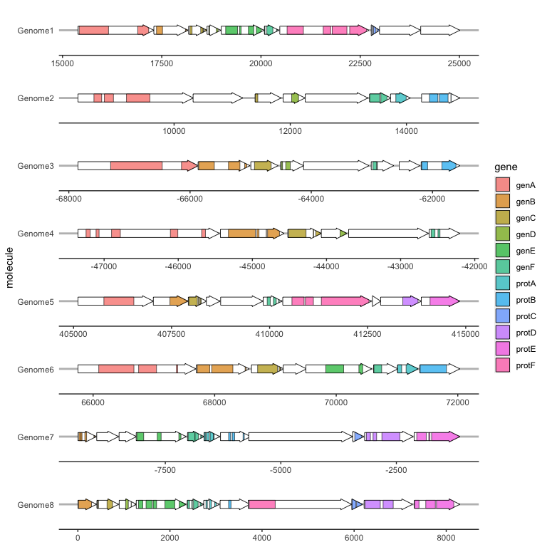
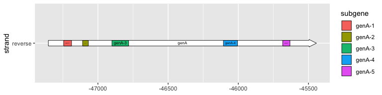
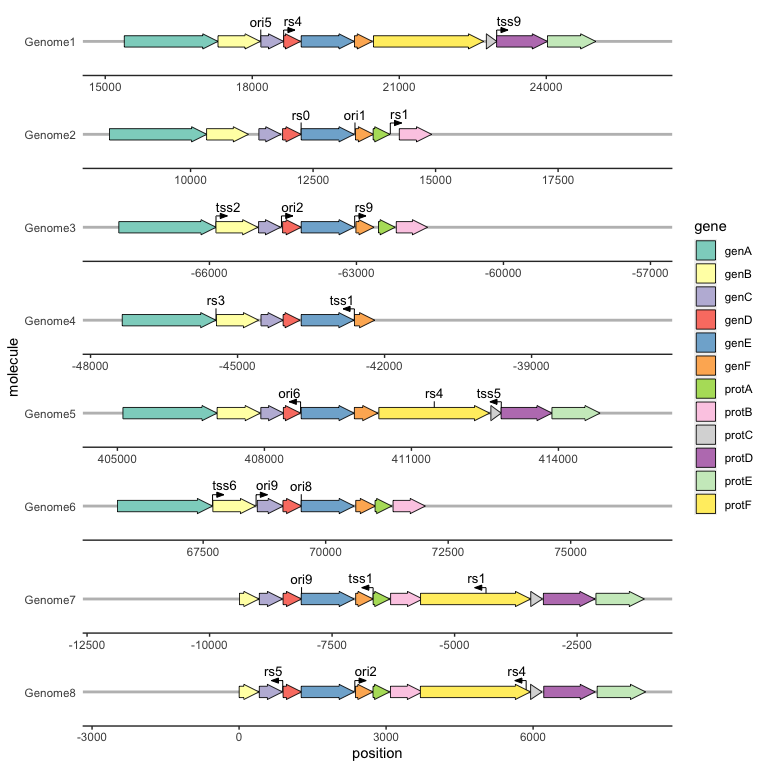
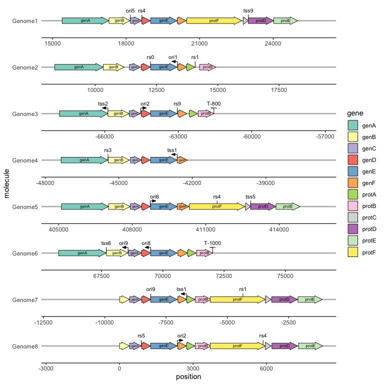

<!-- badges: start -->

[](https://github.com/wilkox/gggenes/actions)
[](https://cran.r-project.org/package=gggenes)
[](https://lifecycle.r-lib.org/articles/stages.html#stable)
<!-- badges: end -->

# gggenes

gggenes is a [ggplot2](https://ggplot2.tidyverse.org) extension for
drawing gene arrow maps.

## Installing gggenes

Install the stable version of gggenes from CRAN:

`install.packages("gggenes")`

If you want the development version, install it from GitHub:

`devtools::install_github("wilkox/gggenes")`

## Drawing gene arrows with `geom_gene_arrow()`

`geom_gene_arrow()` is a ggplot2 geom that represents genes with arrows.
The start and end locations of the genes within their molecule(s) are
mapped to the `xmin` and `xmax` aesthetics respectively. These start and
end locations are used to determine the directions in which the arrows
point. The `y` aesthetic must be mapped to the molecule(s). If you are
drawing more than one molecule, and the numerical locations of the genes
are not similar across molecules, you almost certainly want to facet the
plot with `scales = "free"` to avoid drawing ridiculously large
molecules with ridiculously tiny genes.

``` r
library(ggplot2)
library(gggenes)

ggplot(example_genes, aes(xmin = start, xmax = end, y = molecule, fill = gene)) +
  geom_gene_arrow() +
  facet_wrap(~ molecule, scales = "free", ncol = 1) +
  scale_fill_brewer(palette = "Set3")
```

<!-- -->

## Beautifying the plot with `theme_genes`

Because the resulting plot can look cluttered, a ggplot2 theme
`theme_genes` is provided with some sensible defaults.

``` r
ggplot(example_genes, aes(xmin = start, xmax = end, y = molecule, fill = gene)) +
  geom_gene_arrow() +
  facet_wrap(~ molecule, scales = "free", ncol = 1) +
  scale_fill_brewer(palette = "Set3") +
  theme_genes()
```

<!-- -->

## Aligning genes across facets with `make_alignment_dummies()`

Often you will want a certain gene to be vertically aligned across the
faceted molecules. `make_alignment_dummies()` generates a set of dummy
genes that if added to the plot with `geom_blank()` will extend the
range of each facet to visually align the selected gene across facets.

``` r
dummies <- make_alignment_dummies(
  example_genes,
  aes(xmin = start, xmax = end, y = molecule, id = gene),
  on = "genE"
)

ggplot(example_genes, aes(xmin = start, xmax = end, y = molecule, fill = gene)) +
  geom_gene_arrow() +
  geom_blank(data = dummies) +
  facet_wrap(~ molecule, scales = "free", ncol = 1) +
  scale_fill_brewer(palette = "Set3") +
  theme_genes()
```

<!-- -->

## Labelling genes with `geom_gene_label()`

To label individual genes, provide a `label` aesthetic and use
`geom_gene_label()`. `geom_gene_label()` uses the
[ggfittext](https://github.com/wilkox/ggfittext) package to fit the
label text inside the gene arrows; see the ggfittext documentation for
more details on how it resizes and reflows text to make it fit.

``` r
ggplot(
    example_genes,
    aes(xmin = start, xmax = end, y = molecule, fill = gene, label = gene)
  ) +
  geom_gene_arrow(arrowhead_height = unit(3, "mm"), arrowhead_width = unit(1, "mm")) +
  geom_gene_label(align = "left") +
  geom_blank(data = dummies) +
  facet_wrap(~ molecule, scales = "free", ncol = 1) +
  scale_fill_brewer(palette = "Set3") +
  theme_genes()
```

<!-- -->

## Reversing gene direction with the optional `forward` aesthetic

By default, genes arrows are drawn pointing in the direction implied by
`xmin` and `xmax`. You can override this with the optional `forward`
aesthetic, which can be useful when the gene coordinates and orientation
are encoded as separate variables.

If `forward` is TRUE (the default), or any value that coerces to TRUE
such as 1, the gene will be drawn pointing in the implied direction,
i.e. from `xmin` to `xmax`. If `forward` is FALSE, or any value that
coerces to FALSE such as 0, the gene will be drawn in the reverse of
this implied direction:

``` r
ggplot(example_genes, aes(xmin = start, xmax = end, y = molecule, fill = gene, 
                          forward = orientation)) +
  geom_gene_arrow() +
  facet_wrap(~ molecule, scales = "free", ncol = 1) +
  scale_fill_brewer(palette = "Set3") +
  theme_genes()
```

<!-- -->

## Viewing subgene segments

We can highlight subgene segments, such as protein domains or local
alignments, using `geom_subgene_arrow()`.

This works similarly to `geom_gene_arrow()`, but in addition to `xmin`
and `xmax` (which determine the gene boundaries), we need the aesthetics
`xsubmin` and `xsubmax` to determine the subgene boundaries.
`geom_gene_arrow()` will produce pretty arrowheads, as long as
`xmin >= xsubmin` and `xmax >= xsubmax` for all subgenes (subgenes that
break gene boundaries will be skipped with a warning).

The suggested usage is to use `geom_gene_arrow()` with no fill, and then
add a subgene layer over this:

``` r
ggplot(example_genes, aes(xmin = start, xmax = end, y = molecule)) +
  facet_wrap(~ molecule, scales = "free", ncol = 1) +
  geom_gene_arrow(fill = "white") +
  geom_subgene_arrow(data = example_subgenes,
    aes(xmin = start, xmax = end, y = molecule, fill = gene,
        xsubmin = from, xsubmax = to), color="black", alpha=.7) +
  theme_genes()
```

<!-- -->

To label subgenes, we can use `geom_subgene_label()`, which works
similarly to `geom_gene_label()` with the major difference that it
requires `xsubmin` and `xsubmax` aesthetics (not `xmin` and `xmax`).

``` r
ggplot(subset(example_genes, molecule == "Genome4" & gene == "genA"),
       aes(xmin = start, xmax = end, y = strand)
  ) +
  geom_gene_arrow() +
  geom_gene_label(aes(label = gene)) +
  geom_subgene_arrow(
    data = subset(example_subgenes, molecule == "Genome4" & gene == "genA"),
    aes(xsubmin = from, xsubmax = to, fill = subgene)
  ) +
  geom_subgene_label(
    data = subset(example_subgenes, molecule == "Genome4" & gene == "genA"),
    aes(xsubmin = from, xsubmax = to, label = subgene),
    min.size = 0
  )
```

<!-- -->

## Drawing point genetic features

We can draw point genetic features, such as restriction sites or
transcription start sites, with `geom_feature()`, and label them with
`geom_feature_label()`. Both of these geoms take an optional `forward`
aesthetic to indicate whether a feature is oriented and, if so, in what
direction (`TRUE` meaning oriented towards the right and `FALSE` meaning
towards the left).

``` r
ggplot(example_genes, aes(xmin = start, xmax = end, y = molecule, fill = gene, label = gene)) +
  geom_feature(
    data = example_features,
    aes(x = position, y = molecule, forward = forward)
  ) +
  geom_feature_label(
    data = example_features,
    aes(x = position, y = molecule, label = name, forward = forward)
  ) +
  geom_gene_arrow() +
  geom_gene_label() +
  geom_blank(data = example_dummies) +
  facet_wrap(~ molecule, scales = "free", ncol = 1) +
  scale_fill_brewer(palette = "Set3") +
  theme_genes()
```

<!-- -->

We can draw and label transcription terminators with `geom_terminator()`
and `geom_terminator_label()`.

``` r
ggplot(example_genes, aes(xmin = start, xmax = end, y = molecule, fill = gene, label = gene)) +
  geom_feature(
    data = example_features,
    aes(x = position, y = molecule, forward = forward)
  ) +
  geom_feature_label(
    data = example_features,
    aes(x = position, y = molecule, label = name, forward = forward)
  ) +
  geom_terminator(data = example_terminators, aes(x = position, y = molecule)) +
  geom_terminator_label(data = example_terminators, 
                        aes(x = position, y = molecule, label = name)) +
  geom_gene_arrow() +
  geom_gene_label() +
  geom_blank(data = example_dummies) +
  facet_wrap(~ molecule, scales = "free", ncol = 1) +
  scale_fill_brewer(palette = "Set3") +
  theme_genes()
```

<!-- -->

## Experimental: drawing in polar coordinates

The current development version introduces drawing in polar coordinates,
by adding `coord_polar()` to the plot. This works with all gene,
subgene, feature, and terminator geoms.

``` r
ggplot(example_genes_polar, aes(xmin = start, xmax = end, y = molecule, fill = gene, label = gene)) +
  geom_feature(
    data = example_features_polar,
    aes(x = position, y = molecule, forward = forward)
  ) +
  geom_feature_label(
    data = example_features_polar,
    aes(x = position, y = molecule, label = name, forward = forward)
  ) +
  geom_terminator(data = example_terminators_polar, aes(x = position, y = molecule)) +
  geom_terminator_label(data = example_terminators_polar, 
                        aes(x = position, y = molecule, label = name)) +
  geom_gene_arrow() +
  geom_gene_label() +
  scale_fill_brewer(palette = "Set3") +
  coord_polar() +
  scale_y_discrete(limits = c("", "Genome6", "Genome1"))
```

<!-- -->

## Other genetic features

Do you have an idea, suggestion or request for another type of feature
for gggenes to draw? [Open a new
issue](https://github.com/wilkox/gggenes/issues/new) and it will be
considered.

## Related packages

- [gggenomes](https://thackl.github.io/gggenomes/) for visualising
  comparative genomics
- [plasmapR](https://github.com/BradyAJohnston/plasmapR) for quickly
  drawing plasmid maps from GenBank files
