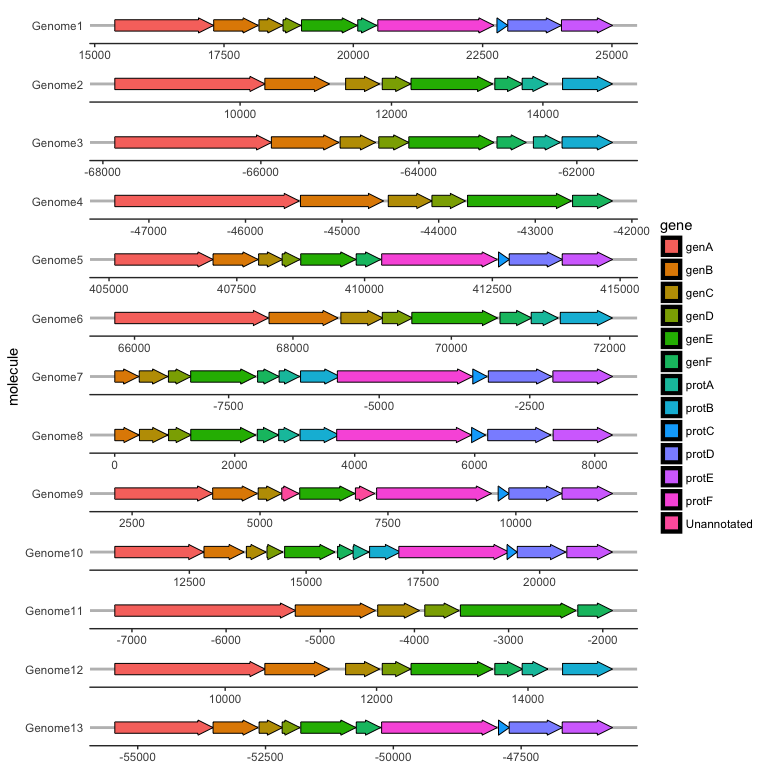

gggenes is a (quite small) set of tools for drawing gene layout maps with ggplot2. `make_alignment_dummies`, `geom_gene_arrow` and `theme_genes` are demonstrated below.

``` r
library(ggplot2)
library(gggenes)

dummies <- make_alignment_dummies(
  example_genes,
  aes(xmin = start, xmax = end, y = molecule, id = gene),
  on = "genE"
)

ggplot(example_genes, aes(xmin = start, xmax = end, y = molecule, fill = gene)) +
  geom_gene_arrow() +
  facet_wrap( ~ molecule, ncol = 1, scales = "free") +
  geom_blank(data = dummies) +
  theme_genes()
```


