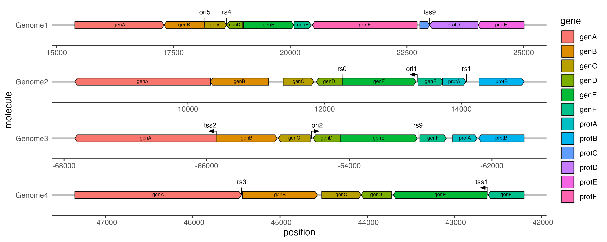

# Summary

Life on Earth uses molecules called nucleic acids, most importantly DNA and RNA, to store information. These nucleic acids encode information in the form of chemical sequences, which form genes as well as regulatory elements and other features of interest to researchers. It is often useful for researchers to draw 'maps' of nucleic acids which show the locations of genes and other features. Because the sequence of nucleotides in a gene is 'read' in a specific direction by the molecular machinery of a cell, these maps often represent genes as arrows drawn along a line representing the nucleic acid molecule. *gggenes* is a package for the R programming language that extends the popular *ggplot2* statistical graphics package so that users can easily draw this type of map.

# Statement of need

The practice within biology of drawing maps to locate genes within a larger nucleic acid molecule predates even the discovery of DNA, with Alfred H. Sturtevant drawing the first maps of the relative position of genes in a chromosome based on linkage (the propensity for genes to be inherited together into the next generation) in 1913 [@Smith:2013]. With the advent of molecular biology and the widespread use of sequencing as a research and clinical tool, this evolved into drawing maps that precisely locate genes and other features of interest within a larger genetic sequence. The publication in 1976 of the first ever completely sequenced genome, for the bacteriophage MS2 virus, had as its first figure a map of the three genes encoded by the MS2 genome [@Fiers:1976] (although due to an unfortunate error this historically signficant figure was inadvertantly swapped with another when the manuscript went to print [@Nature_1976]). A recent review of the phenomenon of overlapping genes illustrates the diversity and robustness of such maps in illustrating both common and esoteric genomic features and arrangements, including their use in 'synteny plots' which are widely used to compare genomic regions [@Wright2022].

The *R* programming language [@R:2022], and particularly the *tidyverse* group of packages, are widely used in the life sciences for manipulating, modelling and visualising data including genetic sequence data. *ggplot2* [@Wickham:2016], a data visualisation package  within the *tidyverse*, provides users with a set of 'geoms', which are R functions that draw geometrical forms commonly used in data visualisation such as points (for scatter plots), lines (for line plots) and columns (for bar plots). The design of *ggplot2* allows it to be easily extended with additional geoms and other plot components, and a large ecosystem of *ggplot2* extensions enables users to draw a range of common and domain-specific visualisations (see https://exts.ggplot2.tidyverse.org).

*gggenes* was developed to help researchers rapidly and easily draw publication-quality gene maps using their existing R, *tidyverse* and *ggplot2* workflows. It provides geoms to draw arrows representing genes (with customisable geometry), text labels for these genes, sub-gene regions of interest and text labels for these, lines and arrow to represent point features, and text labels for these point features. As these geoms are standard *ggplot2* plot components, input data on the genes and features to be plotted can be easily provided in a standard R data frame, and graphical properties of the geoms such as colour, transparency, font etc. can be easily modified to represent variables (e.g. colouring genes by their function) or set to fixed values. 

The gene arrow geom has been designed to minimise effort for researchers by automatically inferring the direction of a gene from a commonly used scheme for encoding gene location, with an optional argument the user can invoke to reverse this inferred direction. This covers a large range of likely input data, reducing the need for pre-processing by the user.

*gggenes* also includes two helper functions that further reduce the effort required to generate a publication-quality graphic, including a function to visually align genes between molecules when multiple molecules are drawn, and a function to adjust the theme settings of the plot to improve its appearance.

The standard syntax for a *gggenes* plot is as follows (\autoref{fig:example}):

```r
ggplot(genes, aes(xmin = start, xmax = end, y = molecule, 
                  fill = gene, label = gene)) +
  geom_feature(
    data = features,
    aes(x = position, y = molecule, forward = forward)
  ) +
  geom_feature_label(
    data = features,
    aes(x = position, y = molecule, label = name, forward = forward)
  ) +
  geom_gene_arrow() +
  geom_gene_label() +
  facet_wrap(~ molecule, scales = "free", ncol = 1) +
  theme_genes()
```



Since its release online in 2017, figures generated with *gggenes* have been used in publications on a range of subjects as diverse as the epidemiology of COVID-19 [@Balloux2022], ancestoral genome dynamics in millipedes [@So2022], and novel genetic elements that may be involved in the control of greenhouse gas emissions [@Al-Shayeb2022]. *gggenes* has also been integrated into other biological software packages [@Liu2023; @McFarland2021].
